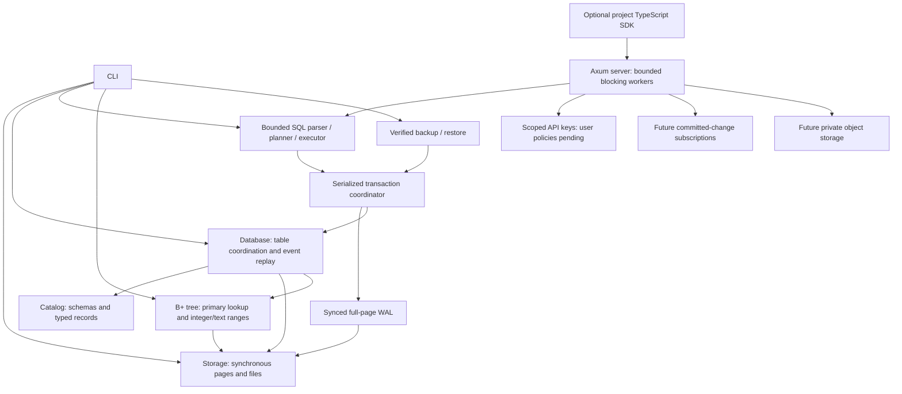

# Technical design

EmilyBase will provide project-isolated relational storage and a backend API.
The engine is original Rust code. PostgreSQL wire or SQL compatibility is not
promised. Initial operating-system target: Linux with a local filesystem.

Storage, catalog, database, WAL, transactions, backup, CLI, a separate index and
the original SQL lexer/parser/planner/executor, isolated project registry and
scoped API-key primitives are implemented. Add other crates when they contain
working behavior, instead of declaring an implemented platform with empty modules.
The network layer calls the synchronous engine through bounded workers;
blocking filesystem work must not run on Tokio reactor threads.

## Storage boundary

File page 0 is an immutable format header. Data pages start at 1. Each page
stores bounded opaque records. The relational layer stores bounded typed events
in those records and reconstructs tables and primary-key maps on open. Its
initialized marker distinguishes it from raw page files. Page and slot addresses
are physical, not public row IDs. See [typed record format](catalog-format.md).
One open pager owns an exclusive advisory file lock. Writes require mutable
access. Checksums detect accidental corruption; they do not authenticate data.

## Transaction boundary

The managed-directory transaction API holds one exclusive journal owner. A
transaction stages a bounded state copy and shared immutable pages. Commit writes
changed full pages and a commit marker, syncs WAL, then publishes committed state.
Rollback/drop discard staged memory; a failed write aborts the transaction.
Recovery checks that redo never rewrites older history, then reconstructs tables.
A checkpoint atomically materializes the current page cache. Recovery ignores
this cache and requires the self-contained WAL. Explicit compaction replaces
repeated images with a complete baseline, preserving history and transaction IDs.
The database directory stays locked across journal inode replacement.
See [ADR 0006](adr/0006-retained-journal.md) and [ADR 0008](adr/0008-self-contained-journal-compaction.md).
MVCC, history vacuuming and background rotation are pending.

## Index boundary

The standalone experimental `commit-format` crate provides typed database/domain/
table/page addresses and fixed-size root bindings. Relational history remains
database-global because a page can contain multiple tables' events; primary pages
have a table namespace. Exact predecessor validation distinguishes a tree revision
from a database transaction. It is outside runtime WAL/server dependencies and
does not change durable selection. Complete topology/live-row validation and a
single shared commit fence remain pending. See
[ADR 0037](adr/0037-experimental-commit-namespaces.md).

The separate `commit-model` prototype stages validated relational events and full
index/root selections. Preparation checks exact predecessors and every current
key/pointer image; a state digest rejects stale or divergent memory publication.
One immutable Arc swap preserves historical views. It is absent from runtime
server/WAL dependencies and provides no durable ACK. Combined capacity/memory
admission and a synced shared writer remain separate gates. See
[ADR 0038](adr/0038-staged-table-index-model.md).

The prototype also caps combined staged/selected index images to 2048 pages and
reports exact standalone component lengths. Snapshot fingerprints stream canonical
images and immutable selections cache validated hashes. This does not bound
decoded/retained heap or reserve memory for concurrent server workers. See
[ADR 0039](adr/0039-combined-model-index-images.md).

The separate opt-in `model-profile` release binary measures bounded synthetic
state cloning, retained readers and canonical fingerprint allocation traffic.
Its optional diagnostic allocator is absent from server/CLI runtime dependencies.
Held project contexts are built serially; this is not parallel-worker or worst-case
heap admission. Count-only bounded reports and real child-process checks execute.
See [ADR 0040](adr/0040-opt-in-model-allocation-diagnostics.md) and
[measured shapes](model-allocation-profiles.md).

The `index` crate implements original B+ tree routing, leaf/internal splits,
replacement, deletion with rotations/merges/root collapse, sorted bulk loading
and linked-leaf scans over a bounded arena of page IDs. The standard map addresses
pages by ID; it does not perform key lookup or replace the tree's routing logic.
Insertion/deletion stage a tree copy; replacement validates a cloned leaf before
publication. Errors keep the exact previous images. Deletion renumbers remaining
arena pages densely without changing opaque row pointers. This bounded foundation
is not a throughput claim or stable durable allocator. Fixed-size images have an
independent `EBIX` codec and whole-tree validation.

The index has a standalone atomic snapshot publisher; table root catalog entry
and WAL participation remain pending. Managed snapshots now use original B+
routing for eligible primary-key point lookups, built from current validated
row locations. Existing row maps still supply scans and longer text keys. The
256-byte index bound remains separate from the catalog's 3072-byte text limit. Future durable integration
must explicitly reconcile those limits, page allocation, pointer lifetime and
transactional split publication. No database-file format changes occur in this
increment. See [ADR 0009](adr/0009-bounded-index-foundation.md) and
[ADR 0010](adr/0010-index-maintenance.md).

Per-table immutable derived caches share initialized trees and stage maintenance
before successful snapshot publication. Failed/rolled-back writes preserve the
committed view. Uninitialized branch cells are replaced before mutation; arena
exhaustion discards a derived cache for dense rebuilding without rejecting table
rows. No independently durable index bytes are added. See
[ADR 0020](adr/0020-validated-live-row-locations.md) and
[ADR 0021](adr/0021-derived-primary-key-trees.md).

Integer primary inequalities in necessary AND conjuncts select linked-leaf
interval lookup after complete binding. Checked normalization preserves i64
boundaries; full predicates still evaluate nullable values. SELECT and staged
UPDATE/DELETE share the bound extraction. Text bounds use UTF-8 byte order, exact NUL
successors and short-tree verification merged with all ordered live keys. Long
keys remain visible before LIMIT; SQL falls back when bounds cannot fit the tree.
Durable index WAL and secondary DDL remain separate work. See
[ADR 0022](adr/0022-integer-primary-range-plans.md) and
[ADR 0026](adr/0026-utf8-primary-range-plans.md).

Borrowed double-ended primary rows merge short-tree and long live keys, validating
each consumed physical image. Single-table no-order or primary-first ORDER BY
reads retain projected fields only and stop after LIMIT TRUE matches; joins and
other orderings retain materialized sorting. Mutation selection accumulates only
the transaction's remaining normal events: selected rows for UPDATE, keys for
DELETE. Every statement shares one atomic script; overflow discards prior staged
work. Cold tree construction and snapshot staging keep their documented bounded
costs, outside the row-work/output estimate. See
[ADR 0028](adr/0028-borrowed-live-primary-rows.md),
[ADR 0029](adr/0029-streamed-primary-sql-order.md) and
[ADR 0030](adr/0030-bounded-mutation-selection.md).

The opt-in stable arena now retains surviving IDs and reuses holes. Canonical
EBIF snapshots bind root/revision/counts, while in-memory deltas bind their exact
base and validate the whole resulting tree. Dense EBIX-1 remains compatible.
Standalone file publication now owns a private directory across snapshot-file
replacement, verifies its exact base and syncs before revision ACK. Managed
table/WAL participation stays pending.
See [ADR 0016](adr/0016-stable-index-snapshots.md).

## Backup boundary

The archive contains a bounded verified committed-WAL prefix, not filesystem
paths or a page-cache copy. It binds format versions, database identity, transaction
boundary, payload size, SHA-256 and header CRC. Verification performs strict table
replay. Restore opens and checks a privately staged engine before atomic no-replace
publication. Original identity is preserved; this does not create a separate
project. See [ADR 0007](adr/0007-verified-backups.md).

## Query boundary

The synchronous `query` crate parses bounded SQL into a typed AST, retaining
parameters separately from SQL text. Schema resolution precedes row evaluation;
strict typed predicates implement three-valued null logic. Plans use existing
primary-key lookup, scans or bounded nested-loop joins. Script writes stage in
managed transactions and results follow commit; errors discard all staged work.
Legacy raw files are not SQL write targets. See [SQL subset](sql.md) and
[ADR 0011](adr/0011-bounded-sql.md).

## Platform boundary

Each project receives a server-controlled directory and catalog. Public IDs must
never be concatenated into filesystem paths. Authorization must bind every
operation, subscription and object access to a project. The dashboard uses
React/TypeScript/Vite; REST uses Axum, Serde and OpenAPI; realtime uses WebSocket.
The TypeScript project SDK uses the documented API; Kotlin and the web dashboard
remain future work. Docker/Compose packages the compiled Rust server and CLI,
with no JavaScript/Python runtime dependency. No external paid service is required.

The synchronous registry portion now lives in `server`, with key primitives in
`auth`. Server-issued IDs select private project directories; display names never
form paths. Scoped one-shot capabilities retain ownership and a per-project gate
while executing through the existing WAL engine. Project metadata has a separate
bounded version/checksum contract. The Axum transport reserves four owned worker permits, awaits the registry
asynchronously, then executes all filesystem work in blocking tasks. Permits
and ownership survive a client disconnect after a blocking commit starts.
See [ADR 0012](adr/0012-isolated-projects.md),
[ADR 0013](adr/0013-bounded-http-transport.md) and [HTTP limits](server.md).
