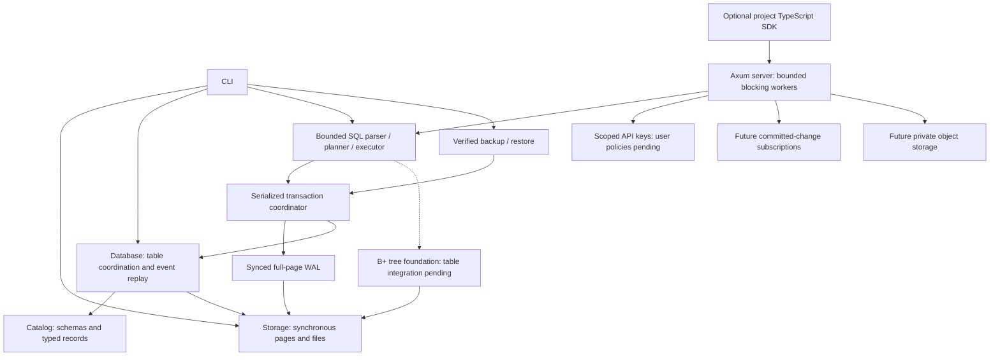

# Technical design

EmilyBase will provide project-isolated relational storage and a backend API.
The engine is original Rust code. PostgreSQL wire or SQL compatibility is not
promised. Initial operating-system target: Linux with a local filesystem.

Storage, catalog, database, WAL, transactions, backup, CLI, a separate index and
the original SQL lexer/parser/planner/executor, isolated project registry and
scoped API-key primitives are implemented. Add other crates when they contain
working behavior, instead of declaring an implemented platform with empty modules.
The network layer calls the synchronous engine through bounded workers;
blocking filesystem work must not run on Tokio reactor threads.

## Storage boundary

File page 0 is an immutable format header. Data pages start at 1. Each page
stores bounded opaque records. The relational layer stores bounded typed events
in those records and reconstructs tables and primary-key maps on open. Its
initialized marker distinguishes it from raw page files. Page and slot addresses
are physical, not public row IDs. See [typed record format](catalog-format.md).
One open pager owns an exclusive advisory file lock. Writes require mutable
access. Checksums detect accidental corruption; they do not authenticate data.

## Transaction boundary

The managed-directory transaction API holds one exclusive journal owner. A
transaction stages a bounded state copy and shared immutable pages. Commit writes
changed full pages and a commit marker, syncs WAL, then publishes committed state.
Rollback/drop discard staged memory; a failed write aborts the transaction.
Recovery checks that redo never rewrites older history, then reconstructs tables.
A checkpoint atomically materializes the current page cache. Recovery ignores
this cache and requires the self-contained WAL. Explicit compaction replaces
repeated images with a complete baseline, preserving history and transaction IDs.
The database directory stays locked across journal inode replacement.
See [ADR 0006](adr/0006-retained-journal.md) and [ADR 0008](adr/0008-self-contained-journal-compaction.md).
MVCC, history vacuuming and background rotation are pending.

## Index boundary

The `index` crate implements original B+ tree routing, leaf/internal splits,
replacement, deletion with rotations/merges/root collapse, sorted bulk loading
and linked-leaf scans over a bounded arena of page IDs. The standard map addresses
pages by ID; it does not perform key lookup or replace the tree's routing logic.
Insertion/deletion stage a tree copy; replacement validates a cloned leaf before
publication. Errors keep the exact previous images. Deletion renumbers remaining
arena pages densely without changing opaque row pointers. This bounded foundation
is not a throughput claim or stable durable allocator. Fixed-size images have an
independent `EBIX` codec and whole-tree validation.

The index has a standalone atomic snapshot publisher; table root catalog entry
and WAL participation remain pending. Managed snapshots now use original B+
routing for eligible primary-key point lookups, built from current validated
row locations. Existing row maps still supply scans and longer text keys. The
256-byte index bound remains separate from the catalog's 3072-byte text limit. Future durable integration
must explicitly reconcile those limits, page allocation, pointer lifetime and
transactional split publication. No database-file format changes occur in this
increment. See [ADR 0009](adr/0009-bounded-index-foundation.md) and
[ADR 0010](adr/0010-index-maintenance.md).

Per-table immutable derived caches share initialized trees and stage maintenance
before successful snapshot publication. Failed/rolled-back writes preserve the
committed view. Uninitialized branch cells are replaced before mutation; arena
exhaustion discards a derived cache for dense rebuilding without rejecting table
rows. No independently durable index bytes are added. See
[ADR 0020](adr/0020-validated-live-row-locations.md) and
[ADR 0021](adr/0021-derived-primary-key-trees.md).

The opt-in stable arena now retains surviving IDs and reuses holes. Canonical
EBIF snapshots bind root/revision/counts, while in-memory deltas bind their exact
base and validate the whole resulting tree. Dense EBIX-1 remains compatible.
Standalone file publication now owns a private directory across snapshot-file
replacement, verifies its exact base and syncs before revision ACK. Managed
table/WAL participation stays pending.
See [ADR 0016](adr/0016-stable-index-snapshots.md).

## Backup boundary

The archive contains a bounded verified committed-WAL prefix, not filesystem
paths or a page-cache copy. It binds format versions, database identity, transaction
boundary, payload size, SHA-256 and header CRC. Verification performs strict table
replay. Restore opens and checks a privately staged engine before atomic no-replace
publication. Original identity is preserved; this does not create a separate
project. See [ADR 0007](adr/0007-verified-backups.md).

## Query boundary

The synchronous `query` crate parses bounded SQL into a typed AST, retaining
parameters separately from SQL text. Schema resolution precedes row evaluation;
strict typed predicates implement three-valued null logic. Plans use existing
primary-key lookup, scans or bounded nested-loop joins. Script writes stage in
managed transactions and results follow commit; errors discard all staged work.
Legacy raw files are not SQL write targets. See [SQL subset](sql.md) and
[ADR 0011](adr/0011-bounded-sql.md).

## Platform boundary

Each project receives a server-controlled directory and catalog. Public IDs must
never be concatenated into filesystem paths. Authorization must bind every
operation, subscription and object access to a project. The dashboard uses
React/TypeScript/Vite; REST uses Axum, Serde and OpenAPI; realtime uses WebSocket.
The TypeScript project SDK uses the documented API; Kotlin and the web dashboard
remain future work. Docker/Compose packages the compiled Rust server and CLI,
with no JavaScript/Python runtime dependency. No external paid service is required.

The synchronous registry portion now lives in `server`, with key primitives in
`auth`. Server-issued IDs select private project directories; display names never
form paths. Scoped one-shot capabilities retain ownership and a per-project gate
while executing through the existing WAL engine. Project metadata has a separate
bounded version/checksum contract. The Axum transport reserves four owned worker permits, awaits the registry
asynchronously, then executes all filesystem work in blocking tasks. Permits
and ownership survive a client disconnect after a blocking commit starts.
See [ADR 0012](adr/0012-isolated-projects.md),
[ADR 0013](adr/0013-bounded-http-transport.md) and [HTTP limits](server.md).
