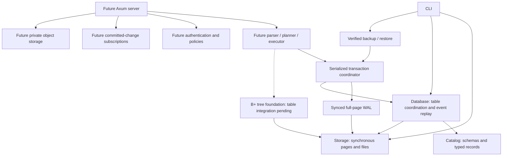

# Technical design

EmilyBase will provide project-isolated relational storage and a backend API.
The engine is original Rust code. PostgreSQL wire or SQL compatibility is not
promised. Initial operating-system target: Linux with a local filesystem.

Storage, catalog, database, WAL, transactions, backup, CLI and a separate index foundation are implemented. Add other crates when they contain
working behavior, instead of declaring an implemented platform with empty modules.
The future network layer will call the synchronous engine through bounded workers;
blocking filesystem work must not run on Tokio reactor threads.

## Storage boundary

File page 0 is an immutable format header. Data pages start at 1. Each page
stores bounded opaque records. The relational layer stores bounded typed events
in those records and reconstructs tables and primary-key maps on open. Its
initialized marker distinguishes it from raw page files. Page and slot addresses
are physical, not public row IDs. See [typed record format](catalog-format.md).
One open pager owns an exclusive advisory file lock. Writes require mutable
access. Checksums detect accidental corruption; they do not authenticate data.

## Transaction boundary

The managed-directory transaction API holds one exclusive journal owner. A
transaction stages a bounded state copy and shared immutable pages. Commit writes
changed full pages and a commit marker, syncs WAL, then publishes committed state.
Rollback/drop discard staged memory; a failed write aborts the transaction.
Recovery checks that redo never rewrites older history, then reconstructs tables.
A checkpoint atomically materializes the current page cache. Recovery ignores
this cache and requires the self-contained WAL. Explicit compaction replaces
repeated images with a complete baseline, preserving history and transaction IDs.
The database directory stays locked across journal inode replacement.
See [ADR 0006](adr/0006-retained-journal.md) and [ADR 0008](adr/0008-self-contained-journal-compaction.md).
MVCC, history vacuuming and background rotation are pending.

## Index boundary

The `index` crate implements original B+ tree routing, leaf/internal splits,
replacement, deletion with rotations/merges/root collapse, sorted bulk loading
and linked-leaf scans over a bounded arena of page IDs. The standard map addresses
pages by ID; it does not perform key lookup or replace the tree's routing logic.
Insertion/deletion stage a tree copy; replacement validates a cloned leaf before
publication. Errors keep the exact previous images. Deletion renumbers remaining
arena pages densely without changing opaque row pointers. This bounded foundation
is not a throughput claim or stable durable allocator. Fixed-size images have an
independent `EBIX` codec and whole-tree validation.

The index currently has no file publisher, root catalog entry or WAL participation;
the relational engine still uses its existing primary-key map. Its 256-byte text
key bound is separate from the catalog's 3072-byte text limit. Future integration
must explicitly reconcile those limits, page allocation, pointer lifetime and
transactional split publication. No database-file format changes occur in this
increment. See [ADR 0009](adr/0009-bounded-index-foundation.md) and
[ADR 0010](adr/0010-index-maintenance.md).

## Backup boundary

The archive contains a bounded verified committed-WAL prefix, not filesystem
paths or a page-cache copy. It binds format versions, database identity, transaction
boundary, payload size, SHA-256 and header CRC. Verification performs strict table
replay. Restore opens and checks a privately staged engine before atomic no-replace
publication. Original identity is preserved; this does not create a separate
project. See [ADR 0007](adr/0007-verified-backups.md).

## Platform boundary (planned)

Each project receives a server-controlled directory and catalog. Public IDs must
never be concatenated into filesystem paths. Authorization must bind every
operation, subscription and object access to a project. The dashboard uses
React/TypeScript/Vite; REST uses Axum, Serde and OpenAPI; realtime uses WebSocket.
TypeScript and Kotlin SDKs will use the documented API. Docker and Compose follow
once a runnable server exists. No external paid service is required.
