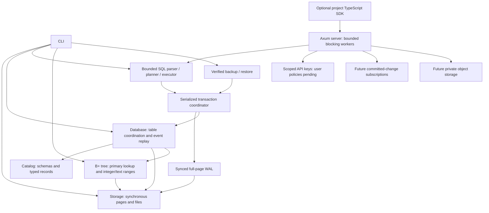

# Technical design

Memory image replay now applies only a bounded canonical tail append over its
validated base, retaining immutable prior pages/rows. Complete model/root/state
validation still surrounds that operation. This changes no stored decoder or
durable selection; see [ADR 0046](adr/0046-shared-tail-history-replay.md).

EmilyBase will provide project-isolated relational storage and a backend API.
The engine is original Rust code. PostgreSQL wire or SQL compatibility is not
promised. Initial operating-system target: Linux with a local filesystem.

Storage, catalog, database, WAL, transactions, backup, CLI, a separate index and
the original SQL lexer/parser/planner/executor, isolated project registry and
scoped API-key primitives are implemented. Add other crates when they contain
working behavior, instead of declaring an implemented platform with empty modules.
The network layer calls the synchronous engine through bounded workers;
blocking filesystem work must not run on Tokio reactor threads.

## Storage boundary

File page 0 is an immutable format header. Data pages start at 1. Each page
stores bounded opaque records. The relational layer stores bounded typed events
in those records and reconstructs tables and primary-key maps on open. Its
initialized marker distinguishes it from raw page files. Page and slot addresses
are physical, not public row IDs. See [typed record format](catalog-format.md).
One open pager owns an exclusive advisory file lock. Writes require mutable
access. Checksums detect accidental corruption; they do not authenticate data.

## Transaction boundary

The managed-directory transaction API holds one exclusive journal owner. A
transaction stages bounded outer metadata and shared immutable pages/tables.
Its first write detaches only the affected row table and physical-location map;
old readers retain the previous objects. Commit writes
changed full pages and a commit marker, syncs WAL, then publishes committed state.
Rollback/drop discard staged memory; a failed write aborts the transaction.
Recovery checks that redo never rewrites older history, then reconstructs tables.
A checkpoint atomically materializes the current page cache. Recovery ignores
this cache and requires the self-contained WAL. Explicit compaction replaces
repeated images with a complete baseline, preserving history and transaction IDs.
The database directory stays locked across journal inode replacement.
See [ADR 0006](adr/0006-retained-journal.md) and [ADR 0008](adr/0008-self-contained-journal-compaction.md).
MVCC, history vacuuming and background rotation are pending.
See [ADR 0041](adr/0041-shared-relational-snapshot-tables.md) for sharing boundaries;
this does not add concurrent managed writers or a heap reservation.
Detached table/location maps also keep immutable key and row-body Arc handles.
Only map structure and replaced rows are private copies; public borrowed/owned
row APIs are unchanged. See [ADR 0042](adr/0042-shared-row-bodies-and-live-keys.md).

## Index boundary

The standalone experimental `commit-format` crate provides typed database/domain/
table/page addresses and fixed-size root bindings. Relational history remains
database-global because a page can contain multiple tables' events; primary pages
have a table namespace. Exact predecessor validation distinguishes a tree revision
from a database transaction. It is outside runtime WAL/server dependencies and
does not change durable selection. Complete topology/live-row validation and a
single shared commit fence remain pending. See
[ADR 0037](adr/0037-experimental-commit-namespaces.md).

The separate `commit-model` prototype stages validated relational events and full
index/root selections. Preparation checks exact predecessors and every current
key/pointer image; a state digest rejects stale or divergent memory publication.
One immutable Arc swap preserves historical views. It is absent from runtime
server/WAL dependencies and provides no durable ACK. Combined capacity/memory
admission and a synced shared writer remain separate gates. See
[ADR 0038](adr/0038-staged-table-index-model.md).

The prototype also caps combined staged/selected index images to 2048 pages and
reports exact standalone component lengths. Snapshot fingerprints stream canonical
images and immutable selections cache validated hashes. This does not bound
decoded/retained heap or reserve memory for concurrent server workers. See
[ADR 0039](adr/0039-combined-model-index-images.md).

The separate opt-in `model-profile` release binary measures bounded synthetic
state cloning, retained readers and canonical fingerprint allocation traffic.
Its optional diagnostic allocator is absent from server/CLI runtime dependencies.
Held project contexts are built serially; this is not parallel-worker or worst-case
heap admission. Count-only bounded reports and real child-process checks execute.
See [ADR 0040](adr/0040-opt-in-model-allocation-diagnostics.md) and
[measured shapes](model-allocation-profiles.md).

The `index` crate implements original B+ tree routing, leaf/internal splits,
replacement, deletion with rotations/merges/root collapse, sorted bulk loading
and linked-leaf scans over a bounded arena of page IDs. The standard map addresses
pages by ID; it does not perform key lookup or replace the tree's routing logic.
Insertion/deletion stage a tree copy; replacement validates a cloned leaf before
publication. Errors keep the exact previous images. Deletion renumbers remaining
arena pages densely without changing opaque row pointers. This bounded foundation
is not a throughput claim or stable durable allocator. Fixed-size images have an
independent `EBIX` codec and whole-tree validation.

The index has a standalone atomic snapshot publisher; table root catalog entry
and WAL participation remain pending. Managed snapshots now use original B+
routing for eligible primary-key point lookups, built from current validated
row locations. Existing row maps still supply scans and longer text keys. The
256-byte index bound remains separate from the catalog's 3072-byte text limit. Future durable integration
must explicitly reconcile those limits, page allocation, pointer lifetime and
transactional split publication. No database-file format changes occur in this
increment. See [ADR 0009](adr/0009-bounded-index-foundation.md) and
[ADR 0010](adr/0010-index-maintenance.md).

Per-table immutable derived caches share initialized trees and stage maintenance
before successful snapshot publication. Failed/rolled-back writes preserve the
committed view. Uninitialized branch cells are replaced before mutation; arena
exhaustion discards a derived cache for dense rebuilding without rejecting table
rows. No independently durable index bytes are added. See
[ADR 0020](adr/0020-validated-live-row-locations.md) and
[ADR 0021](adr/0021-derived-primary-key-trees.md).

Integer primary inequalities in necessary AND conjuncts select linked-leaf
interval lookup after complete binding. Checked normalization preserves i64
boundaries; full predicates still evaluate nullable values. SELECT and staged
UPDATE/DELETE share the bound extraction. Text bounds use UTF-8 byte order, exact NUL
successors and short-tree verification merged with all ordered live keys. Long
keys remain visible before LIMIT; SQL falls back when bounds cannot fit the tree.
Durable index WAL and secondary DDL remain separate work. See
[ADR 0022](adr/0022-integer-primary-range-plans.md) and
[ADR 0026](adr/0026-utf8-primary-range-plans.md).

Borrowed double-ended primary rows merge short-tree and long live keys, validating
each consumed physical image. Single-table no-order or primary-first ORDER BY
reads retain projected fields only and stop after LIMIT TRUE matches; joins and
other orderings retain materialized sorting. Mutation selection accumulates only
the transaction's remaining normal events: selected rows for UPDATE, keys for
DELETE. Every statement shares one atomic script; overflow discards prior staged
work. Cold tree construction and snapshot staging keep their documented bounded
costs, outside the row-work/output estimate. See
[ADR 0028](adr/0028-borrowed-live-primary-rows.md),
[ADR 0029](adr/0029-streamed-primary-sql-order.md) and
[ADR 0030](adr/0030-bounded-mutation-selection.md).

The opt-in stable arena now retains surviving IDs and reuses holes. Canonical
EBIF snapshots bind root/revision/counts, while in-memory deltas bind their exact
base and validate the whole resulting tree. Dense EBIX-1 remains compatible.
Standalone file publication now owns a private directory across snapshot-file
replacement, verifies its exact base and syncs before revision ACK. Managed
table/WAL participation stays pending.
See [ADR 0016](adr/0016-stable-index-snapshots.md).

## Backup boundary

The archive contains a bounded verified committed-WAL prefix, not filesystem
paths or a page-cache copy. It binds format versions, database identity, transaction
boundary, payload size, SHA-256 and header CRC. Verification performs strict table
replay. Restore opens and checks a privately staged engine before atomic no-replace
publication. Original identity is preserved; this does not create a separate
project. See [ADR 0007](adr/0007-verified-backups.md).

## Query boundary

The synchronous `query` crate parses bounded SQL into a typed AST, retaining
parameters separately from SQL text. Schema resolution precedes row evaluation;
strict typed predicates implement three-valued null logic. Plans use existing
primary-key lookup, scans or bounded nested-loop joins. Script writes stage in
managed transactions and results follow commit; errors discard all staged work.
Legacy raw files are not SQL write targets. See [SQL subset](sql.md) and
[ADR 0011](adr/0011-bounded-sql.md).

## Platform boundary

Each project receives a server-controlled directory and catalog. Public IDs must
never be concatenated into filesystem paths. Authorization must bind every
operation, subscription and object access to a project. The dashboard uses
React/TypeScript/Vite; REST uses Axum, Serde and OpenAPI; realtime uses WebSocket.
The TypeScript project SDK uses the documented API; Kotlin and the web dashboard
remain future work. Docker/Compose packages the compiled Rust server and CLI,
with no JavaScript/Python runtime dependency. No external paid service is required.

The synchronous registry portion now lives in `server`, with key primitives in
`auth`. Server-issued IDs select private project directories; display names never
form paths. Scoped one-shot capabilities retain ownership and a per-project gate
while executing through the existing WAL engine. Project metadata has a separate
bounded version/checksum contract. The Axum transport reserves four owned worker permits, awaits the registry
asynchronously, then executes all filesystem work in blocking tasks. Permits
and ownership survive a client disconnect after a blocking commit starts.
See [ADR 0012](adr/0012-isolated-projects.md),
[ADR 0013](adr/0013-bounded-http-transport.md) and [HTTP limits](server.md).

## Experimental model lifetime coordinator

The optional synchronous ModelPool owns its synthetic models and uses private
leases to admit project identities, reader objects, active writers and distinct
current/retained/pending generations. Reservations occur before construction or
staging, remain through prepare, and transfer/release on publish/discard. Old readers
retain both their generation and project namespace. Instance checks prevent cross-pool
publication with equal state digests. The wrapper exposes borrowed rows instead of
clonable raw snapshots. It is independent of managed WAL and HTTP ownership, and
counts model lifetimes rather than heap/RSS. Read/build temporaries and caller-owned
copies need separate budgeting. See [ADR 0043](adr/0043-bounded-model-lifetimes.md).

Raw prepared memory transactions now retain an exact base for physical image
planning. ImagePlan omits unchanged roots/pages, scopes original EBPG/EBIX images
by database/domain/table and binds both state fingerprints. Independent replay
preserves old history slots, rebuilds original tree deltas and validates complete
row/pointer coverage before returning a new raw Model. Owned plans/replay temporaries
are outside ModelPool. The standalone EBIP-1 envelope now checks complete byte
lengths and nested physical components before materializing images; full replay
still selects no durable fence. See
[ADR 0044](adr/0044-validated-physical-image-plans.md) and
[ADR 0048](adr/0048-bounded-physical-image-envelope.md).

## Follow-up: retained serialized payload reservation

The optional [EnvelopePool](image-buffer-admission.md) now atomically reserves
complete EBIP byte lengths and buffer slots before encode/copy, including admitted
clones. Admitted preparation can serialize without releasing writer/generation
leases or exposing raw state. Raw plans, decoded/retained model state, temporary
validation and whole-process/server/WAL admission remain outside this scope;
[ADR 0049](adr/0049-admitted-serialized-image-buffers.md) closes no durable gate.

## Follow-up: streamed standalone index verification

[Complete index admission](streamed-index-admission.md) now checks bounded map/page
identity, topology and physical round trips one page at a time. Fingerprints and
wire bytes stay frozen. Borrowed target validation and direct private-candidate
admission remove redundant complete images/trees in delta generation/application.
Isolated full-capacity allocation guards and independent corruption/state models
execute under [ADR 0050](adr/0050-streamed-index-snapshot-admission.md). Candidate
map/retained/transient/worker quotas and the shared durable writer remain open.

## Immutable index page ownership

The bounded original B+ arena now retains private Arc-backed immutable page bodies
across tree clones. Each clone owns its map/root/count; mutations and delta replay
replace only changed bodies while complete topology and physical checks remain.
Historical readers retain prior pages even if a newer arena reuses their IDs.
Dense remapping can still detach many pages. This reduces repeated decoded copies
but does not reserve model/transient/worker heap or change runtime WAL decisions.
See [ADR0051](adr/0051-shared-immutable-index-pages.md) and
[observations](shared-index-pages.md).

The subsequent [primary projection](shared-primary-export.md) converts the derived
arena through a fully checked private stable-ID map sharing immutable pages. Exact
live key/pointer coverage and long-key exclusions still verify; the source cache
retains its own policy. No complete image reconstruction is needed for export.

The optional [DecodedPlanPool](decoded-plan-admission.md) separately reserves
decoded EBIP vector payload and physical owner slots before materialization.
Shared immutable handles retain one charge until the last owner releases the
actual vectors; independent decodes charge independent copies. Serialized source
budgets stay separate. Model/cache/staging/replay/transient memory is outside this
pool, and exact base replay remains mandatory under
[ADR 0053](adr/0053-admitted-decoded-image-vectors.md).

## Follow-up: admitted destination replay lifetimes

[Destination replay](admitted-model-replay.md) now reserves per-project/global
writer exclusion and its output generation before complete physical reconstruction.
Borrowed AdmittedPlan input keeps separate vector accounting. Non-clonable output
retains leases through exact-instance publication/discard and exposes only borrowed
state. Actual ownership, refusal, historical readers, generated sequences and
thread caps execute under [ADR 0054](adr/0054-admitted-physical-replay-generations.md).
This counts lifetimes, not model/cache/staging/transient heap or runtime workers;
the combined durable writer and production gates remain open.

## Follow-up: compact retained relational payload

[Retained record ownership](retained-record-capacity.md) now removes caller
spare String/Vec capacity after validation, before shared live state retains it.
Reproduced schema/row/native regressions, exact wire parity, old readers, generated
histories and WAL1/2 commit/rollback/recovery checks execute under
[ADR 0055](adr/0055-compact-retained-record-payloads.md).
Caller input peaks and model/cache/map/staging/replay-transient budgets remain
outside this retained-shape guarantee; durable-index and production gates stay open.

## Follow-up: compact retained index buffers

[Retained index ownership](retained-index-capacity.md) now removes caller
spare text/key/pointer/child-vector capacity before immutable page publication.
Reproduced constructor/insertion/native failures, both ID policies, old owners,
full capacity, format parity and standalone reopen checks execute under
[ADR 0056](adr/0056-compact-retained-index-buffers.md).
Input peaks and allocator/model/cache/staging/replay-transient budgets remain
outside this shape guarantee; the combined durable writer and production gates
remain open.

## Follow-up: primary-key inner join probes

[Eligible JOIN plans](primary-key-joins.md) now probe the original right
primary index from a borrowed left scan. Complete ON/WHERE, long-key physical
checks, ordering/limits and existing work/output bounds stay active. Necessary
equality under AND is supported; other conditions keep the original fallback.
EXPLAIN and the matching strict project SDK accept primary_join under
[ADR 0057](adr/0057-primary-key-join-probes.md). This enables no new stored
format, durable-index acknowledgement, chained/outer join or production gate.

## Follow-up: stream ordered primary joins

[Unique left-primary JOIN order](ordered-primary-joins.md) now uses the
original point/range/double-ended source cursor and stops after accepted LIMIT
matches. Streamed plans retain selected output fields while complete ON/WHERE
and shared work/output budgets stay active. Other orders retain full stable sort
and intermediate limits under [ADR 0058](adr/0058-streamed-primary-join-order.md).
Stored formats, durability acknowledgements and production gates are unchanged.

## Follow-up: bounded primary-join sorting

[Small sorted JOIN limits](limited-primary-join-sort.md) now retain only
the best LIMIT full candidates with stable tie/null/type ordering. Full ON/WHERE
and every source probe still execute; work, matched-row, retained-byte and output
bounds stay active under [ADR 0059](adr/0059-bounded-primary-join-sort.md).
Other access paths keep their original limits. Stored formats, durable-index
acknowledgement and production gates are unchanged.

## Follow-up: admit projected payload before copying

[Output admission](projected-output-admission.md) now checks the shared
script allowance before copying each selected row. Full sorting projects
incrementally; streamed paths use the same borrowed preflight. A reproduced
native refusal peak falls from 99388593 to 14210993 bytes under
[ADR0060](adr/0060-admit-projected-output-before-copy.md), with identical
errors/committed bytes. This is logical output accounting; whole-memory, durable
index and production gates remain open.

## Follow-up: borrowed ordinary table sorting

[Non-primary table orders](limited-table-sort.md) now borrow checked
source rows and retain only the best LIMIT candidates. Necessary points/ranges
restrict access, while complete WHERE and every candidate still execute. Stable
ties, all supported sort types, original work/match/retained/output bounds and
WAL 1/2 recovery hold under [ADR 0061](adr/0061-borrowed-bounded-table-sort.md).
The reproduced warmed 1500-row peak falls from 4842026 to 11634 requested bytes.
This operation-local observation closes no cold-memory, transient, combined
durable-writer or production gate. General fallback joins retain their limits.

## Follow-up: borrow before candidate admission

[Borrowed candidates](borrowed-query-candidates.md) let primary JOIN
predicates/projection read checked source slices directly. Sorted table/JOIN heaps
compare and charge winners before cloning; discarded candidates still consume
the original match/work counts. Reproduced warmed allocation totals nearly halve
under [ADR 0062](adr/0062-admit-borrowed-candidates-before-cloning.md).
Physical validation still allocates; these operation totals are not a process
quota. Stored formats, durability acknowledgements and production gates remain.
