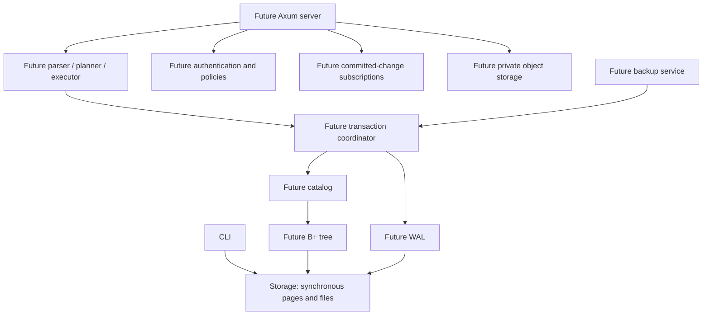

# Technical design

EmilyBase will provide project-isolated relational storage and a backend API.
The engine is original Rust code. PostgreSQL wire or SQL compatibility is not
promised. Initial operating-system target: Linux with a local filesystem.

Only storage and CLI crates exist initially. Add other crates when they contain
working behavior, instead of declaring an implemented platform with empty modules.
The network layer will call the synchronous engine through bounded workers;
blocking filesystem work must not run on Tokio reactor threads.

## Storage boundary

File page 0 is an immutable format header. Data pages start at 1. Each page
stores bounded opaque records; table schemas, typed values and primary keys are
a later increment. Page and slot addresses are physical, not public row IDs.
One open pager owns an exclusive advisory file lock. Writes require mutable
access. Checksums detect accidental corruption; they do not authenticate data.

## Transaction boundary (planned)

Start with a single serialized writer and strict locking. A commit will append
bounded redo records and a commit marker to WAL, sync WAL, and only then
acknowledge success. No page becomes durable before its corresponding WAL.
Recovery replays complete committed transactions; checkpoint completion must be
durable before WAL truncation. MVCC is deferred until the baseline is proven.

## Platform boundary (planned)

Each project receives a server-controlled directory and catalog. Public IDs must
never be concatenated into filesystem paths. Authorization must bind every
operation, subscription and object access to a project. The dashboard uses
React/TypeScript/Vite; REST uses Axum, Serde and OpenAPI; realtime uses WebSocket.
TypeScript and Kotlin SDKs will use the documented API. Docker and Compose follow
once a runnable server exists. No external paid service is required.
